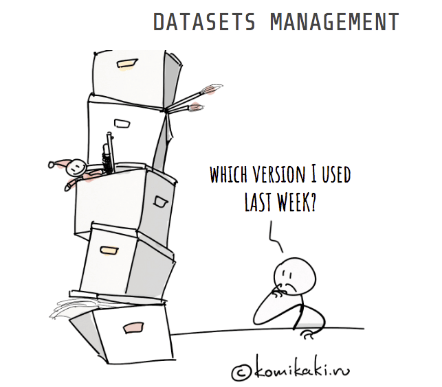
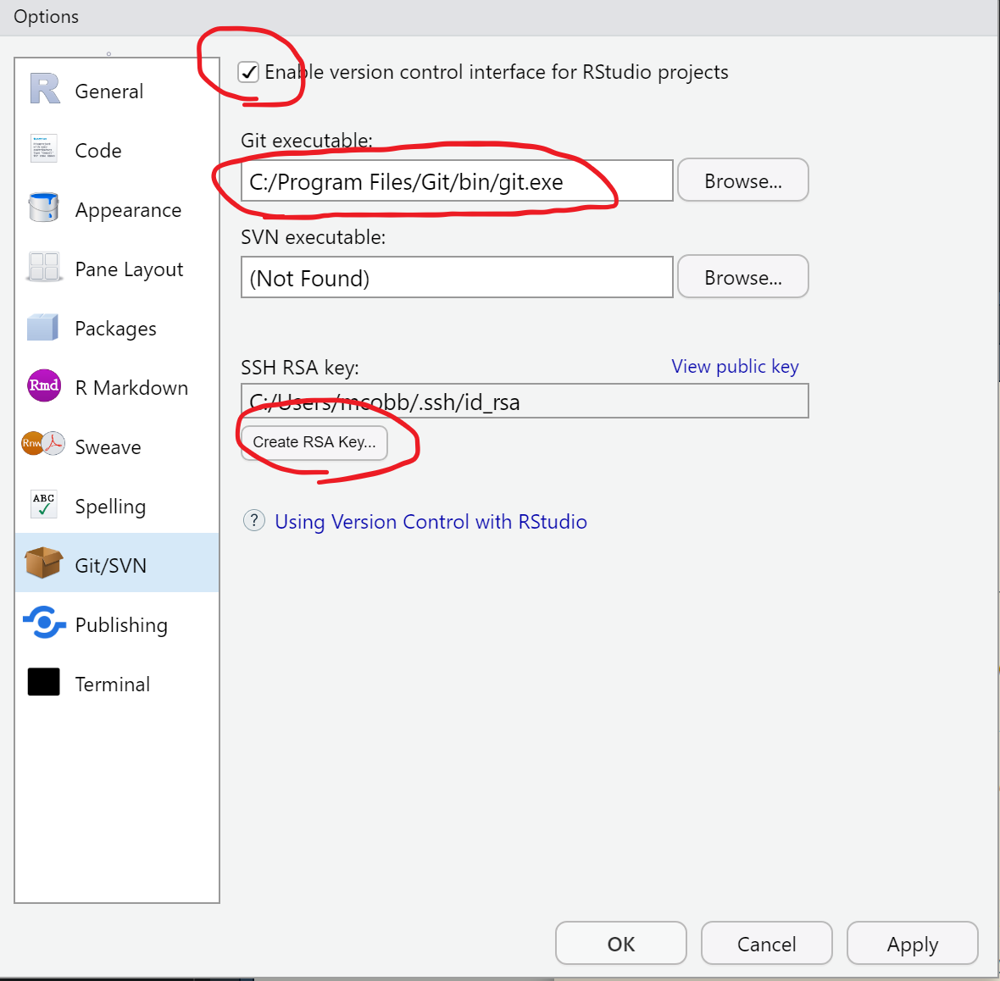
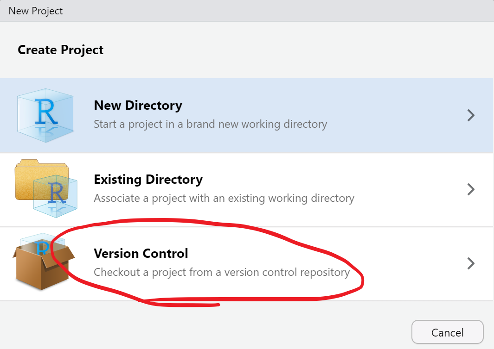
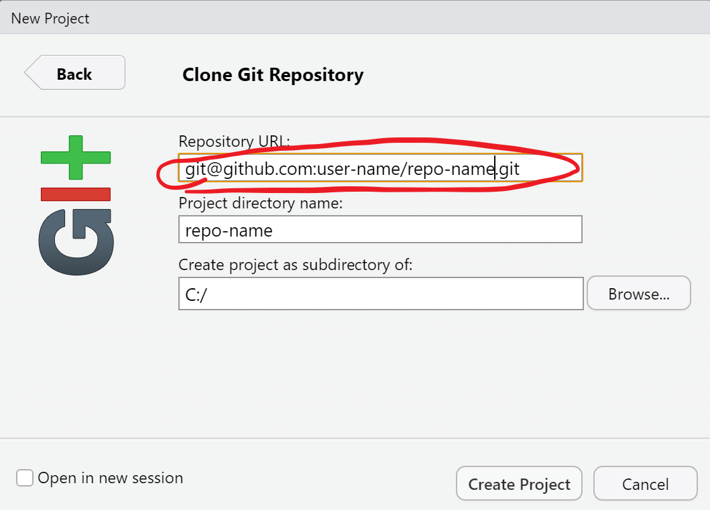
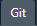
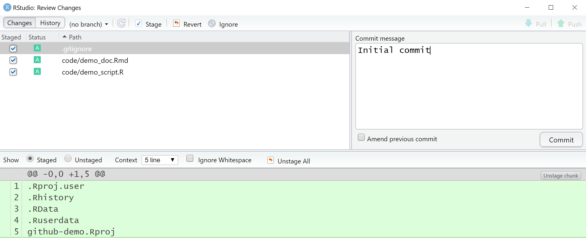
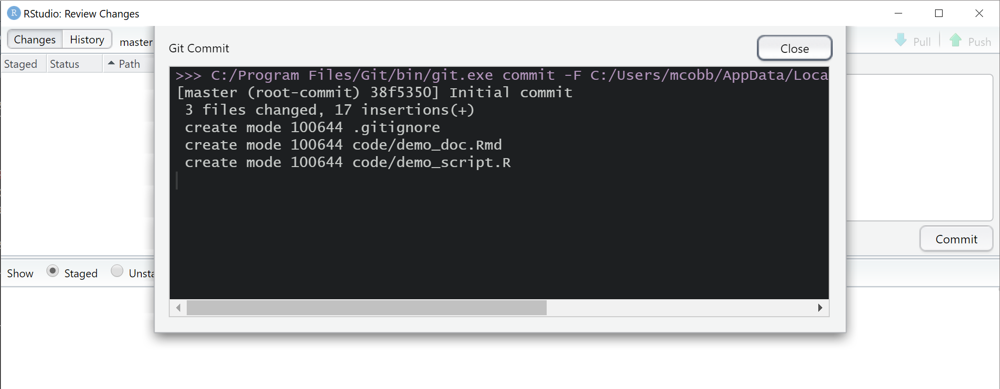
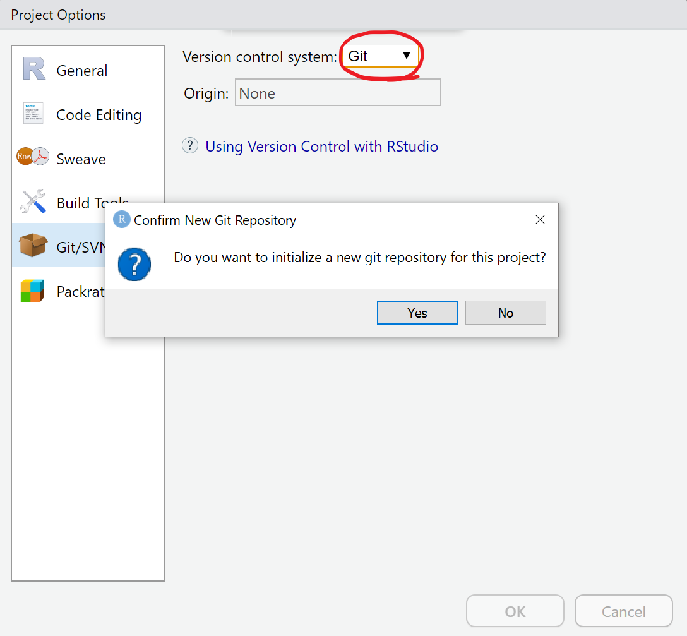

```{r setup, include=FALSE}
options(htmltools.dir.version = FALSE)
```

```{r xaringan-themer, include=FALSE}
library(xaringanthemer)
solarized_light(
  code_font_family = "Fira Code",
  code_font_url    = "https://cdn.rawgit.com/tonsky/FiraCode/1.204/distr/fira_code.css"
)
```


background-image: url(images/)


---
# Outline 
<br>
.right-column[
## Intro to version control
## Intro to Git and GitHub
## Getting set up
## Demo
]

???
- Today, I will introduce (maybe review for many folks) the idea of version control and provide some reasons when and why you should use it. 

- Next, I will describe how Git implements version control for your work. I argue that Git is an ideal version control system for work with R, largely because it works hand-in-hand with GitHub, the online "hub" for sharing and storing projects using Git. I will discuss how GitHub complements version control using Git.

- I will then give an outview of how to get set up for using Git and GitHub to manage versions of R project files in RStudio

- Finally, I will provide some demos on how to create a new RStudio project with version control and, similarly, how to add version control to an existing RStudio project.


---
background-image: url(images/finalfinal.gif)
background-size: contain


???

I think that we've all struggled with trying to manage versions of a file, as shown in the comic here. In our case, an R script evolves over time and sometimes in response to input from multiple collaborators. To maintain versions, what people often do is to rename files, giving them names like like "Final1" or "finalfinal1" or "finalfinal1_revised"...

Another approach might be to append an ISO date to the file name (something like "myscript_20200319"). This at least gives the reader an understanding of when the last changes probably occurred, but this approach still provides no description of what was last changed, who made the changes, and why? Wouldn't that info also be useful to know? This approach also does not work for common situations such as when multiple authors are both working independently on the same project on the same date.

As you might see where I'm going, a better method is needed.


---
# What is ~~vrshun contro1~~ version control?

.pull-left[


**Version control**: the management of changes to documents, computer programs, web sites, and other collections of information (data).

**Purpose**:

1. To revert to previous version of a file

2. To keep a history of changes (for yourself and others)

3. To collaborate on your work simultaneously while managing conflicts
]

.pull-right[

]


???
This gets us to the concept of version control.

Version control, as defined by the great minds of WikiPedia (haha) is "the management of changes to documents, computer programs, large web sites, and other collections of information."

The purpose of version control are to..

For straightforward coding project, there is a single person and two points: start and end. Commonly, versions are managed by saving the files under different file names and perhaps older versions of files are moved into a folder call something like "archive". Reverting to an old version is done by reopening a version in the "archive folder". Sound familiar??

When the project increases in complexity though, there can be other steps in the process, such as bug fixes, and feature requests. With many points in the development timeline (and points that are often happening concurrently), it can be really useful (and sometimes necessary) to have control over the versions along the development path and the development history overall. 

This is a complicated thing. Wouldn't it be nice if there were software that could do that for you??


---
background-image: url(images/git.png)
background-size: cover

???

There are! In fact, there are many software available that can help with version control. You might have heard of a few, two of the most well-known are Apache Subversion (SVN) and Git. 

Because this presentation is for FWS R users, I will focus on one of these VCSs called Git. There are a number of appealing things about Git for us:

- Git is open source, 
- Git is free, 
- Git is a distributed system (you don't have to rely on a remote repository hub), 
- you can run Git within RStudio, and
- R users have generally adopted GitHub (which relies on Git) for package development and sharing.

Next I will give an 10,000 ft overview of how Git works to manage versions.


---
# How does it work?

.center[]


???
So how does this thing work? The workflow is actually pretty understandable for even the non-techy. Here's a broad rundown of the basic workflow that Git uses to manage versions of file contents:

1. First, you create and edit project files in a local (e.g., your desktop) **working directory**. 

2. If you want to start a version history of these edits, the first step is create a local repository (**localrepo** here) that holds the files that git creates to manage version histories. You access Git functions from the shell (the Git BASH, although the command prompt also works), which is a command line interface accessible from RStudio and directly from Windows. Once you've navigated to your directory in the shell, the command to initialize a repository is simply **git init**. This creates a hidden folder (.git) in your working directory that houses the local repository.
The next step is to add your content, referred to as **staging** files. The command to stage files from your file directory is **git add**. What this does is to save the **contents** of each file as blobs (binary large objects) in your local repository. Each blob object is indexed by a unique SHA (unique 40 character string, referred to as the key or hash). This command then also creates a tree object (you can think of it as an index) that points to the blob objects and provides identifiers and path names for each blob object that you have staged.

3. After staging files that you want to track, the next step is to create a snapshot of the index and blobs and commit these changes to your local repository on your computer. This is called a commit, and you do this with the **git commit** command. In the commit, you are required to create a commit message. This is a description of specifically what was updated and if applicable what bug or problem was addressed. Each tree, commit and blob object has it's own unique hash. Together, those elements are added to a tree data structure which lives inside  the ".git/objects" folder.

4. The rest of the workflow is just rinsing and repeating. You repeatly stage and commit changes to a local repository. Each commit is chained to the previous commit and points back it to for information that is unchanged. 

5. So that's the local repo workflow, but what if you want to share your work or if you are collaborating with remote partners? This is when you need to share your changes with a remote  repository, such as GitHub (which we will talk more about later). Saving commits from a local repository to a remote repository is a called a **push**. The command **git push** uploads the local repository contents to the remote repository. For the examples today, this would be a repository on GitHub. 

6. The opposite of a push is called a **pull**. **git pull** command is used to fetch and download content from a remote repository and update the local repository with that content. 

Git handles content in snapshots, generally for each commit, and knows how to apply or roll back changes between snapshots. You can think of these as revisions, or screenshots from a video.


---
background-image: url(images/git_tree.png)


???
Ok, so that describes how you stage, commit and push changes, but you might be wondering, how do a series of commits relate to each other?

This graphic shows the structure of Git objects as you make multiple commits over time and develop a version history for a project.

The first commit (orange) is shown at the bottom, the second commit in the center and the third commit at the top. So, we are working chronologically from bottom to top. Each commit builds upon the next and are related. In fact, an earlier commits are called "parent" and the following commit is called a "child".

- In the example shown here, the first commit (again at the bottom) adds a file called "test.txt." The content of this file is saved as a blob (83baae..), which is referenced by the tree object.

- The second commit modifies test.txt, so it creates a new blob. It also adds a new file called "new file".

- The third commit adds a new subdirectory to the working directory that contains the original test.txt file. Notice that instead of creating another new blob, it simply creates a pointer (bak) to the tree in the first commit. Since content of test.txt and new.txt in the working directory are unchanged, the third commit tree points back to the same blobs for these.

Ok, so that is the basic workflow for what's call a single **branch**. So how can multiple people work on a single project at the same time?


---
background-image: url(images/git_branch.png)
background-size: contain


???
A branch is a fundamental means of launching a seperate line of development with a project. Often a branch is then reconciled and merged with other branches. There are numerous reasons to create branches:

- it can represent a release version for a software project.
- it can represent a development phase of a project
- it can isolate development on a feature or fix.
- it can be the work of an individual contributor.

This graph shows the development of a project over time (left to right). Each circle represents a commit. The main branch (MASTER) is in the center. There are two branches stemming from the main branch. The bottom branch diverged from the master branch by adding or modifying the project to address Feature 1. It was then merged back into the master branch. The upper branch also diveged from the master branch and was merged in a seperate commit after Feature 1.


---
# Best practices

.right-column[
## How often should you commit?

## What about those commit messages?

## Should I commit generated files?

## When should you create a new branch?
]

???
There are a few questions that can come up for folks newer to Git. One of these is **'How often should you commit?'**. There are many answers to that question:
- Keep commits small and focused
- Whenever you get to a point when something works. In practice, that might mean a few times an hr.
- Not time based: Whenever you add a new feature.
- As often as possible.
- Before you call it a day.

Back in the days before kids and a rational fear of death, I used to rock climb, so I like Hadley Wickham's analogy between making commits in Git and adding protection while climbing. If you are new to the game, you will probably be making a lot of commits. If you have some experience and are very confident in what you are doing, you might run it out longer between commits. The advantage is speed: no having to stop your progress. The obvious disadvantage is increased risk of a really bad situation. The wider the gap between protection, the further a climb will fall if they fall. The further you spread out commits, the more you risk losing if something breaks or fails.

What about commit messages? Descriptive commit messages that concisely describe the change will make life easier for future you and everyone else. Explains "what" and "why" not "how".
- The first line is the subject line. Seperate the body of the message (if you it) from the subject with a space.
- Use the imperative mood for the subject ("Fix typo in introduction to user guide" rather than "Fixes typo in introduction to user guide" or "Fixed typo in introduction to user guide"). No periods. This is Git's default.

Don’t commit generated files
Generally, only those files should be committed that have taken manual effort to create, and cannot be re-generated. Files can be re-generated at will can be generated any time, and normally don’t work git's line-based tracking as well. It is useful to add a .gitignore file in your repository’s root to automatically tell Git which files or paths you don’t want to track. In our case this includes the .RProj file and most derived data generated by scripts.

Another questions is: **'when should you create a new branch?'** Again there is no right answer. If you are planning on starting into a side project. When you are working on a specific task (bug fix). Basically, whenever you need code isolation for a development effort.


---
background-image: url(images/github.jpg)
background-size: cover


???
So I've talked a lot about Git. How does GitHub factor into all this? 

GitHub is a website and free Git repository hosting service. You can think of it as a cloud-based remote repository. It provides a web-based graphical interface to much of what you have to do locally using command line in Git. You can use it on your own and (if you pay) limit access to your work, but the real beauty of GitHub is that it promotes collaborative development.


---
background-image: url(images/git-and-github-workflow.png)
background-size: contain


???
Top left shows the local git workflow that I described, including the git add (staging) and git commit (committing). Git push and pull are used to share changes from your local repository to your remote Git repository. A **fork** in GitHub allows you to clone any public repository out there into your repository (Sam's repo in this example). You can use this approach to collaborate on their efforts without any risk to the original repository. If you want to merge your commits back to the source repository, you submit what's called a **pull request**, which is reviewed by the owner of the source repository. If there are no conflicts, then the changes can be merged with the source repository. Alternatively, if you have collaborator (such as Carlos) they can clone your repository to a local repository, make local commits, if you provide permission, then push these commits to the remote. 


---
# Initial setup

- Install **git** (requires FWS admin). 
    + Windows: https://git-scm.com/download/win

- Introduce yourself. Tell git your name and email address (the same one from GitHub).
    + In the **shell** (*"Tools/Shell..." from new RStudio session*), run:

```{}
git config --global user.name "your-full-name"
git config --global user.email "your-email-address"
```


---
# Initial setup (cont.)

.pull-left[
- In **RStudio**, navigate to "*Tools/Global Options/Git/SVN*" and:  

    + Check the box for "Enable version control interface for RStudio projects".
    
    + Direct RStudio to your git executable file (git.exe). The default location is: "*C:/Program Files/Git/bin/git.exe*".
    
    + Create an SSH/RSA key.
]

.pull-right[

]


---
# Initial setup (cont.)

- In **GitHub**:

    + [Create a GitHub user account](https://github.com/join).
    
    + Join the FWS GitHub organization ([@USFWS](https://github.com/USFWS)).
    
    + Join or create a Team in FWS GitHub organization (makes it easier to manage permissions).
    
    + [Add the SSH key](https://github.com/settings/ssh/new) that you created in RStudio to your GitHub account ("*Settings/SSH and GBG keys/New SSH key*"). You only need to do this once.
    
    + Create a GitHub repository in the USFWS Github organization by contacting an  [owner](https://github.com/orgs/USFWS/people?query=role%3Aowner).


---
# Options for getting started...

<br>
<br>
## 1. Create a new RStudio project with version control 
<br>
## 2. Add version control to an existing RStudio project


---
# Create a new RStudio project with version control 

.pull-left[
- Create a GitHub repository, if you've not already.

- Create a new RStudio Project. 
    + Chose *Version Control* and *Git*. 
    
    + Enter your repository's URL. **Note that this is password-protected SSH URL (_NOT THE HTTP URL!_)**. For example *git@github.com:your-user-name/your-repo.git*. 
    
    + Name the project and assign a directory. 

- Make local changes and save them.
]

.pull-right[



]
   
    
---
# Create a new RStudio project with version control 

.pull-left[
- In **RStudio**
    + Navigate to the  tab and check the boxes next the files and folders that you want included.
    
    + Select . 
    
    + Add a commit message.
    
    + Click  and then . 
        
- In **GitHub**:
    + Confirm that your changes were pushed to your GitHub repository.
]

.pull-right[



]


---
# Add version control to an RStudio project

.pull-left[
- Create a GitHub repository

- Open an existing RStudio project. In **Tools/Project Options/Git/SVN**, update **Version Control System** from **(None)** to **Git**. Initialize a new git repository.

- Under the **Git** tab in Rstudio, check files that you want Git to ignore. This is genenally output files and your .Rproj file. 

- Uncheck your ignore files. Check all files that you want to stage. Click **Commit**.

- Add a commit message.

- Click **Commit**. You've created a local Git repository!

]

.pull-right[


]
???


---
# Add version control to an RStudio project

- To push your local Git repository to GitHub. In the shell, type:

```{}
git remote add origin git@github.com:user-name/repository-name.git
git push -u origin master
```

- In GitHub:

    * Confirm that your changes were pushed to your GitHub repository.
    
     
---
# Glossary of terms
 
**Branch**: A named pointer to a specific snapshot. It notes the place where new changes should be applied to when this branch is used. When a change is applied to a branch, then also the branch label moves to the new commit. 

**Commit** (*verb and noun*): To create a snapshot of your code at a specific time. The name of the resulting snapshot.  

**Diff**: The differences of between file versions of a project.

**Fork**: A clone of the remote repository that you manage. Forks let you make changes to a project that you don't manage without affecting the original repository. You can fetch updates from or submit changes to the original repository with pull requests.

**Git**: A free and open source distributed version control system.  

**GitHub**: A website for hosting projects that use Git.  

**Gitignore**: A file that specifies intentionally untracked files that Git should ignore.  

**History**: A series of snapshots committed for a repository over time.


---
# Glossary of terms (cont.)

**Merge**: A command to integrate version histories from multiple branches into a single branch.  

**Origin**: The shorthand name for the remote repository that a project was originally cloned from.  

**Parent**: The prior commit. Initial commit don't have a parent and merges have two parents.  

**Pull**: A command used to upload local repository contents to a remote repository. This is how you transfer commits from your local repository to the remote repository.  

**Push**: A command used to update a remote branch and local copy of the remote branch. Allows you to create new branches in the remote repository. 

**Revert**: To roll back one or more patch sets on the working directory, then creates a new commit on the result.  

**Shell**: The software that lets you interact with the computer via command line.  

**Snapshot**: A version created by the commit operation.


---
# Glossary of terms (cont.)

**SHA1 (secure hash algorithm)**: A unique identifier for an individual commit, tree or blob. 

**SSA Key**: An access credential that is used in the Secure Shell network protocol used to encrypt remote communications between machines. 

**Stage**: To prepare a file for a commit.


---
# Links to resources

- Git and GitHub basics
    + [Understanding the GitHub Workflow](https://guides.github.com/introduction/flow/)
- Installing Git and get it working smoothly with GitHub and RStudio
    + [Happy Git and GitHub for the useR](https://happygitwithr.com/)
    + [The "Git and GitHub" chapter in Hadley Wickham's "R Packages"](http://r-pkgs.had.co.nz/git.html)
    + [Using Git within RStudio (University of Chicago Computing for Social Sciences)]([Happy Git and GitHub for the useR](https://happygitwithr.com/)
    + [An introduction to Git and how to use it with RStudio (The R class-R programming for biologists)](https://r-bio.github.io/intro-git-rstudio/)  
    + [How to use Git with R and RStudio (Reproducible Research Workshop, U. of Zurich)](http://www.geo.uzh.ch/microsite/reproducible_research/post/rr-rstudio-git/)

- Tips and tricks
    + [How to write a Git Commit Message (Chris Beams)](https://chris.beams.io/posts/git-commit/)
    
- Publishing R Markdown documents using GitHub Pages
    + [GitHub whitepaper](https://resources.github.com/whitepapers/github-and-rstudio/)
    
    
---
class: center, middle

# Demo #1

## Creating a new RStudio project with version control


???
1. Create a new RStudio project with Git version control

2. Add content.

3. Stage, Add Commit message and Commit changes to local repository.

4. Create a new repository in GitHub

6.     a. Push the local repository to the GitHub remote repo.

    
---
class: center, middle

# Demo #2

## Adding version control to an RStudio project


---
class: center, middle

# Bonus Content! (if time allows)

## Installing an R package from GitHub

.left[
```{r, eval=FALSE}

# Load devtools:
install.packages(devtools)

# Install package from GitHub:
devtools::install_github("user-name/package-name)

```
]

???

Here's a quick and easy way to share an R package from GitHub.
```{r, eval=FALSE}
install.packages(devtools)
devtools::install_github("USFWS/SppDistMonProj")
```
